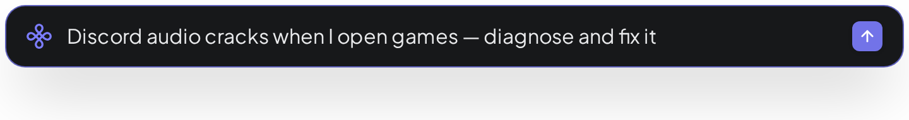
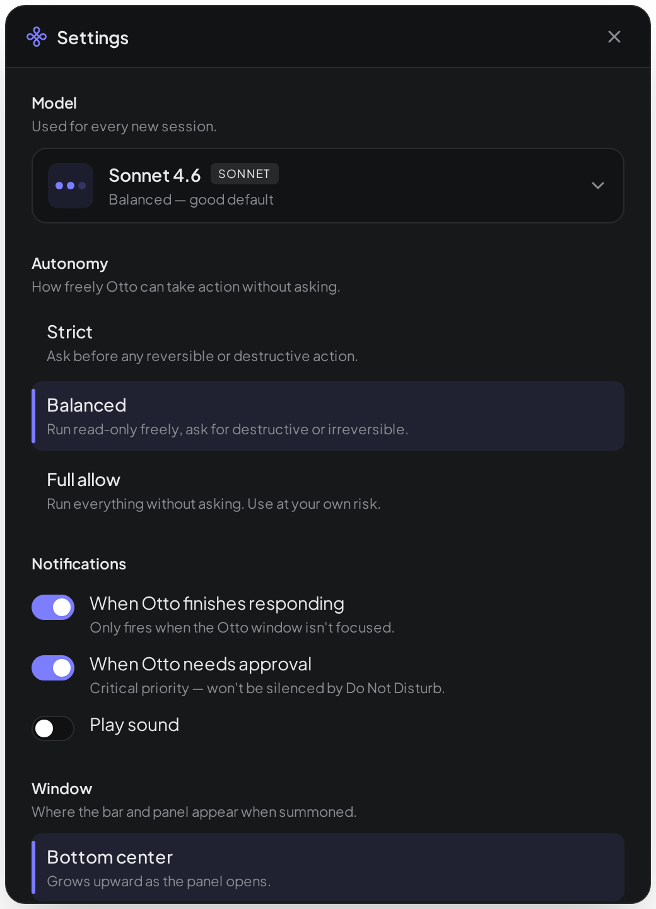

<p align="center">
  
</p>

<h1 align="center">Otto</h1>

<p align="center">
  <strong>A computer coworking agent that acts, not advises.</strong>
</p>

<p align="center">
  <a href="https://github.com/darkharasho/otto/releases/latest"></a>
  <a href="https://github.com/darkharasho/otto/blob/main/LICENSE"></a>
  <a href="https://github.com/darkharasho/otto/releases"></a>
</p>

---

## Press a hotkey. Tell Otto what's broken. Walk away.

Otto is a desktop coworker for your whole machine. Game stuttering? Discord audio cracking? Some app eating CPU you can't trace? Hit the global hotkey, describe the symptom, and Otto investigates — screenshotting windows, reading logs, running diagnostic shells, browsing for fixes, and applying them with your permission. It's the difference between "here's what to try" and "I tried it, here's what worked."

<p align="center">
  
</p>

---

## Features

### Action over guidance
Otto runs on the Claude Agent SDK with a computer-use loop: screenshots, mouse, keyboard, shell, web search, and page reading. It diagnoses *and* fixes — it doesn't hand you a checklist.

### Three autonomy modes
Pick **Strict** (every tool call needs approval), **Balanced** (reads + reversible actions are auto-approved, destructive actions prompt), or **Full allow** (Otto runs unattended). Every tool is tagged by action class — `read` / `reversible` / `destructive` / `irreversible` — and a hard denylist blocks catastrophic commands no matter the mode.

<p align="center">
  
</p>

### Long-running observation
Otto can sit and watch — sampling CPU, listening for log lines, polling a window's title — until a transient problem reproduces, then capture the state for analysis.

### Per-machine memory
Quirks Otto learns ("on this box, killing PulseAudio fixes Discord; the trackpad gets confused after sleep") get written to a local markdown knowledge file and carried forward across sessions. No cloud sync, no leakage.

### Global hotkey + tray
Otto lives in the system tray. A hotkey raises the command bar; another dismisses it. The app never demands your attention — you summon it.

### Cross-platform shell adapters
Per-OS shell, process, and window adapters mean Otto knows how to enumerate windows on Wayland, list services on Windows, and read logs on macOS without your help.

### Native notifications + auto-update
Tool approvals and turn-complete events ping the system notification center when Otto's window is in the background. Updates check on startup and notify you to install on next quit.

---

## Quick start

### Download

Grab the latest release for your platform:

- **Linux** — [AppImage / deb](https://github.com/darkharasho/otto/releases/latest)
- **Windows** — [Installer](https://github.com/darkharasho/otto/releases/latest) (unsigned — click "More info → Run anyway" on SmartScreen)
- **macOS** — [DMG (Intel + Apple Silicon)](https://github.com/darkharasho/otto/releases/latest) (signed + notarized)

### Prerequisites

Otto uses the Claude Agent SDK. You'll need an Anthropic API key set in Settings on first launch, or via `ANTHROPIC_API_KEY` in your environment.

### Build from source

```bash
git clone https://github.com/darkharasho/otto.git
cd otto
npm install
npm run dev              # development
npm run package          # build distributable for current platform
```

---

## Tech stack

| Layer        | Technology                              |
|--------------|-----------------------------------------|
| Framework    | Electron 33                             |
| Frontend     | React 18, TypeScript 5.6, Vite          |
| Agent        | Claude Agent SDK                        |
| Storage      | better-sqlite3                          |
| Updates      | electron-updater                        |
| Images       | sharp                                   |
| Build        | electron-builder + electron-vite        |

---

## Contributing

Contributions welcome. Fork, branch, PR.

```bash
git checkout -b my-feature
npm run typecheck
npm run lint
npm test
```

---

## License

See [LICENSE](LICENSE) for details.

---

<p align="center">
  <sub>Built for people who'd rather have it fixed than understand why.</sub>
</p>
